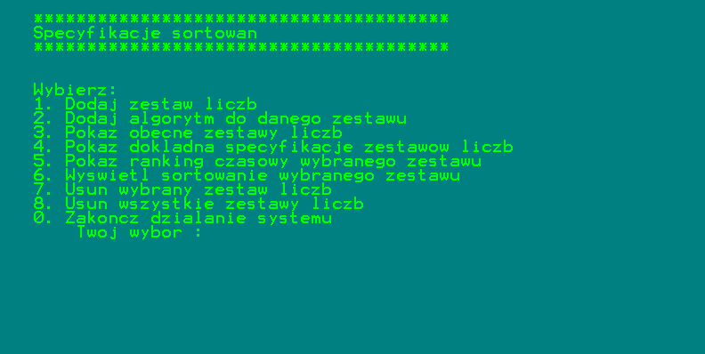
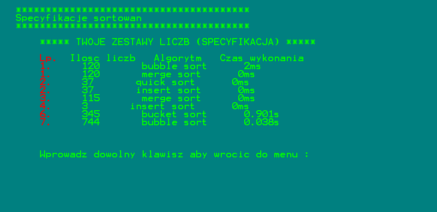

# Sorting specifications

This is an console application which shows the specification of sorting algorithms on specific sets of numbers.

## Install and open
Clone the repository and open .sln file in Microsoft Visual Studio. Then run the application.

## Features and options

- addition of a set of numbers
- assigning the algorithm to the selected set of numbers 
- checking the exact specification of the current sets of numbers
- checking the execution time ranking of the assigned algorithms for the selected set of numbers
- displaying the sorting result of the selected set of numbers 
- deleting a set of numbers

## Stack
C++

## Preview screenshot

